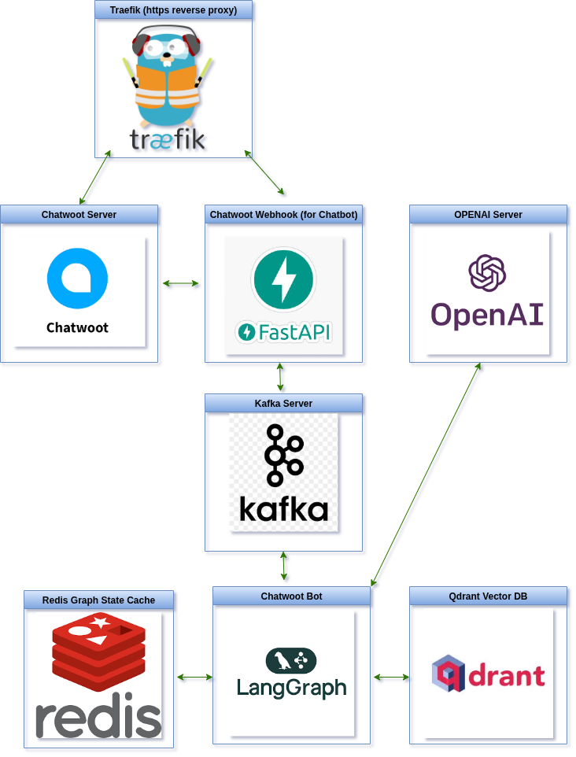

# chatwoot-bot
**`Chatwoot Bot Kafka Bridge Langgraph RAG Processor`**

- https://github.com/HuzaifaIrfan-Infrastructure/kafka-dev
- https://github.com/HuzaifaIrfan-Web/chatwoot-webhook

<!-- •[Link](#)

<hr>

## 🎬 Demo Video

[](https://www.youtube.com/watch?v=video_id)



-->


# 🚀 Usage

## Create .env
```sh
cp .env.example .env
```
- Add OPENAI_API_KEY in .env

## Copy example Markdown files in data/
```sh
cp -r example_data/ data/
```

## Copy and edit example config
```sh
cp config.py.example config.py
```

## Create Vector Embeddings from markdown files in data/*.md and Store them to qdrant DB
```sh
sh vectorize.sh
```

## Run Docker
```sh
docker compose up --build
```

# 🛠️ Development

- https://github.com/HuzaifaIrfan-Infrastructure/redis-dev
- https://github.com/HuzaifaIrfan-AI/qdrant-dev

## Create Vector Embeddings from markdown files in data/*.md and Store them to local qdrant DB
```sh
uv run vectorize_qdrant.py
```

## Run CLI Chat
```sh
uv run chat.py
```


# 🤝🏻 Connect with Me

## Huzaifa Irfan

- 💬 Just want to say hi?
- 🚀 Have a project to discuss?
- 📧 Email me @: [hi@huzaifairfan.com](mailto:hi@huzaifairfan.com)
- 📞 Visit my Profile for other channels:

[](https://github.com/HuzaifaIrfan/)
[](https://www.huzaifairfan.com)

# 📜 License

Licensed under the GPL3 License, Copyright 2025 Huzaifa Irfan. [LICENSE](LICENSE)

<hr />

Last Updated on 2025-06-15
